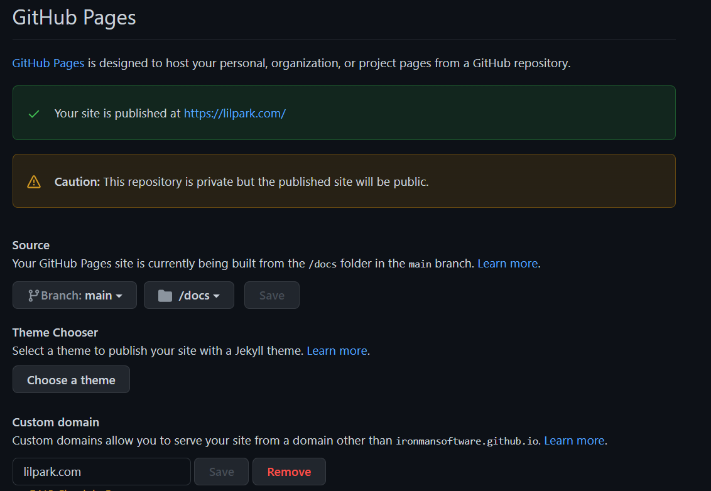

# Little Park

Don't know what to do with your domain? Why not park a park? Plant some pretty, little trees to make the internet a little more green.

# Plant your Park

To plant your park, you can fork this repo and setup GitHub pages to point to your custom domain. Configure your DNS and you'll have a [lilpark](https://lilpark.com) up and running. 

## Configure Your Domain

You'll need to setup your DNS settings to point to GitHub in order to plant your part. If you want to point your [apex domain to GitHub](https://docs.github.com/en/pages/configuring-a-custom-domain-for-your-github-pages-site/managing-a-custom-domain-for-your-github-pages-site#configuring-an-apex-domain), setup some A records using the GitHub IP addresses. 

Next, you'll need to tell GitHub to point to your custom domain. Go to settings and then click Pages.

Finally, point to your domain name. This might take awhile to verify. 

After a little bit, you'll have a park planted at your domain. 🥳

## Manicure Your Park

Parks are generated dynamically. Adjust you park with `Park.jsx`. Once you've made some changes, run `npm run build` and commit the changes.